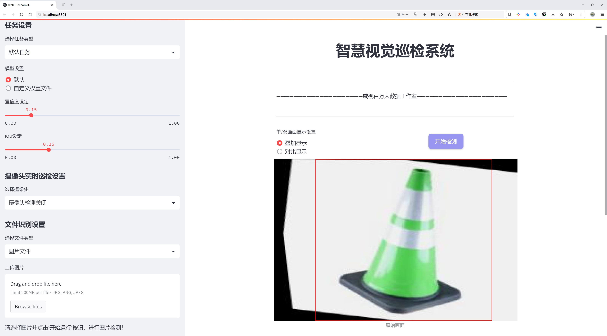
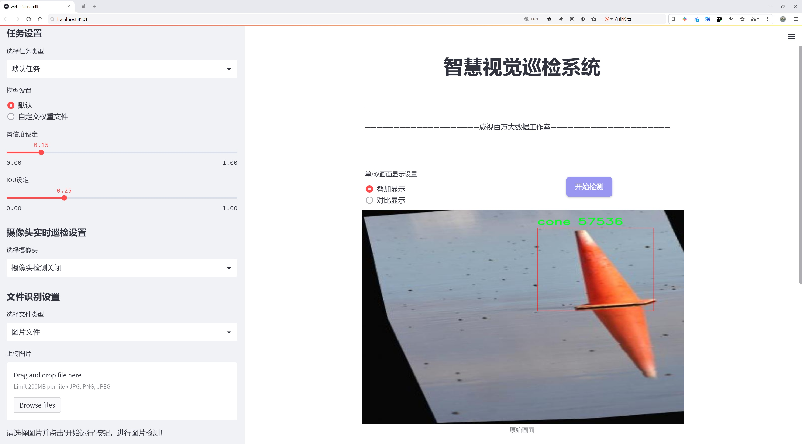
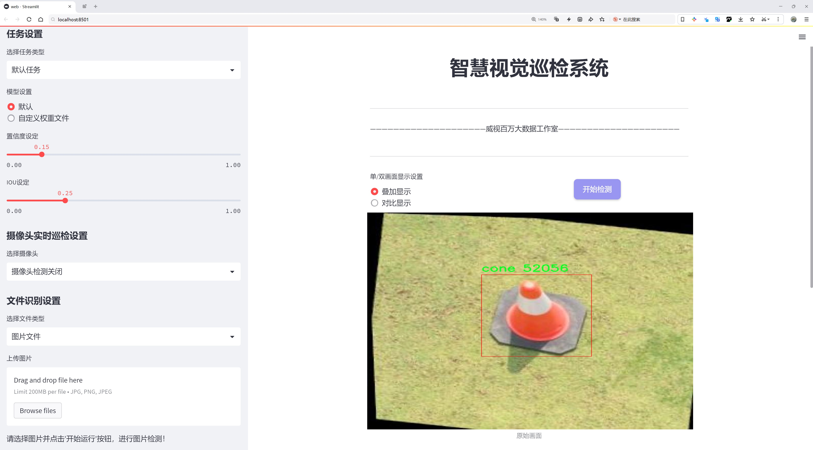
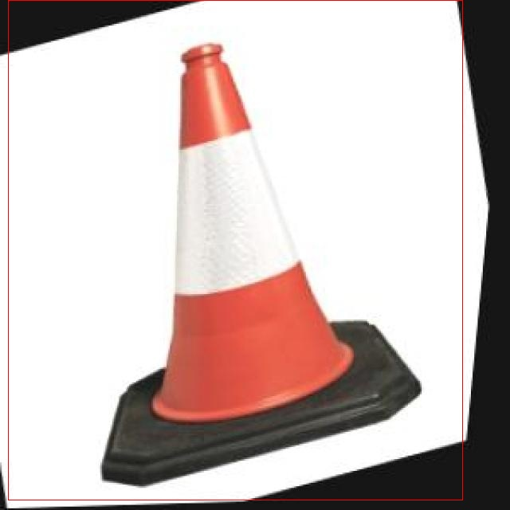
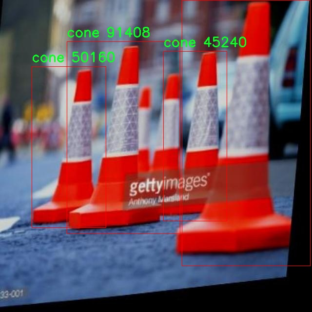
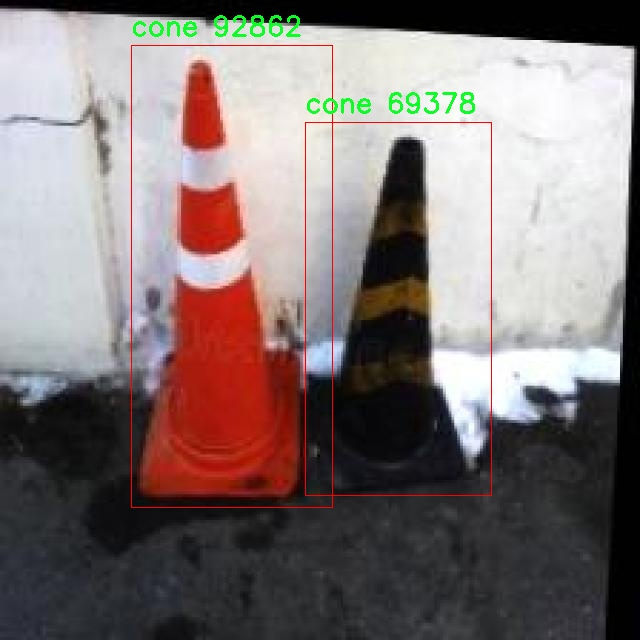
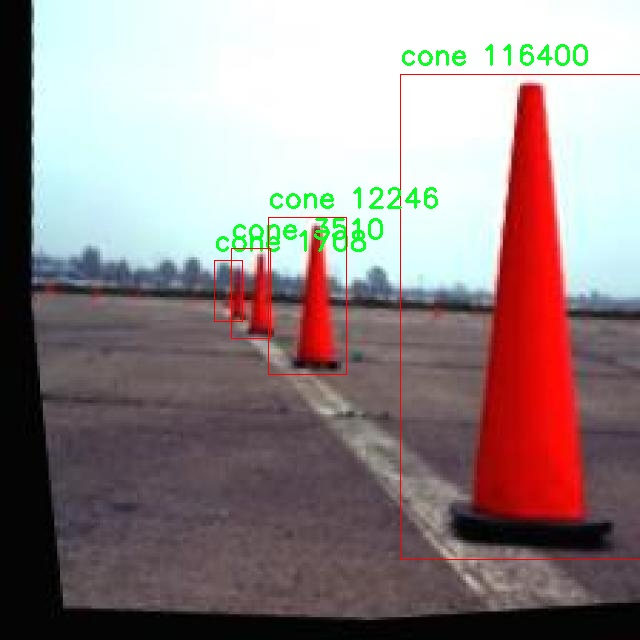
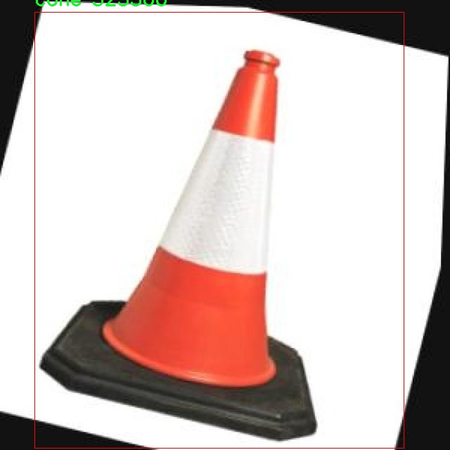

# 交通三角锥检测系统源码分享
 # [一条龙教学YOLOV8标注好的数据集一键训练_70+全套改进创新点发刊_Web前端展示]

### 1.研究背景与意义

项目参考[AAAI Association for the Advancement of Artificial Intelligence](https://gitee.com/qunmasj/projects)

项目来源[AACV Association for the Advancement of Computer Vision](https://kdocs.cn/l/cszuIiCKVNis)

研究背景与意义

随着城市化进程的加快，交通管理面临着日益严峻的挑战。交通安全问题不仅影响到人们的出行体验，也关系到公共安全和社会经济的发展。在交通管理中，交通标志和警示设施的有效识别与监测是确保交通安全的重要环节。交通三角锥作为一种常见的交通引导设施，广泛应用于道路施工、事故现场及临时交通管制等场景。准确、高效地检测和识别交通三角锥，不仅可以提升交通管理的智能化水平，还能有效减少交通事故的发生。因此，基于深度学习的交通三角锥检测系统的研究具有重要的理论价值和实际意义。

近年来，随着计算机视觉技术的快速发展，基于深度学习的目标检测算法在各类视觉任务中表现出色。其中，YOLO（You Only Look Once）系列算法因其高效性和实时性而受到广泛关注。YOLOv8作为该系列的最新版本，进一步提升了检测精度和速度，适用于复杂的交通场景。然而，YOLOv8在特定目标的检测上仍存在一定的局限性，尤其是在多类别目标混合出现的情况下。为了提升交通三角锥的检测性能，针对YOLOv8进行改进，构建一个高效的交通三角锥检测系统，显得尤为必要。

本研究所使用的数据集包含2500张图像，涵盖了7个类别，包括鼓、管、单车、汽车、锥形标志、行人和面包车。这一多样化的数据集为模型的训练和测试提供了丰富的样本，有助于提升模型在复杂场景下的泛化能力。通过对不同类别目标的共同学习，模型能够更好地理解交通场景中的物体关系，进而提高对交通三角锥的检测精度。此外，数据集中包含的多种交通设施和行人等元素，使得模型在实际应用中能够更好地适应不同的交通环境。

本研究的意义不仅在于提升交通三角锥的检测精度，更在于推动智能交通系统的发展。通过改进YOLOv8算法，构建高效的交通三角锥检测系统，可以为智能交通管理提供技术支持，助力实现交通流量的智能监控与管理。随着智能交通技术的不断进步，未来的交通管理将更加依赖于自动化和智能化手段，从而提升交通安全和效率。

综上所述，基于改进YOLOv8的交通三角锥检测系统的研究，不仅为交通安全提供了技术保障，也为智能交通系统的建设奠定了基础。通过对交通三角锥的高效检测，能够有效提升交通管理的智能化水平，降低交通事故的发生率，最终实现安全、高效的交通环境。这一研究不仅具有重要的学术价值，也为实际交通管理提供了切实可行的解决方案。

### 2.图片演示







##### 注意：由于此博客编辑较早，上面“2.图片演示”和“3.视频演示”展示的系统图片或者视频可能为老版本，新版本在老版本的基础上升级如下：（实际效果以升级的新版本为准）

  （1）适配了YOLOV8的“目标检测”模型和“实例分割”模型，通过加载相应的权重（.pt）文件即可自适应加载模型。

  （2）支持“图片识别”、“视频识别”、“摄像头实时识别”三种识别模式。

  （3）支持“图片识别”、“视频识别”、“摄像头实时识别”三种识别结果保存导出，解决手动导出（容易卡顿出现爆内存）存在的问题，识别完自动保存结果并导出到tempDir中。

  （4）支持Web前端系统中的标题、背景图等自定义修改，后面提供修改教程。

  另外本项目提供训练的数据集和训练教程,暂不提供权重文件（best.pt）,需要您按照教程进行训练后实现图片演示和Web前端界面演示的效果。

### 3.视频演示

[3.1 视频演示](https://www.bilibili.com/video/BV1Px2gYfEyC/)

### 4.数据集信息展示

##### 4.1 本项目数据集详细数据（类别数＆类别名）

nc: 7
names: ['Drum', 'Tube', 'bicycle', 'car', 'cone', 'person', 'van']


##### 4.2 本项目数据集信息介绍

数据集信息展示

在本研究中，我们采用了名为“Cone Detection”的数据集，以训练和改进YOLOv8模型在交通三角锥检测方面的性能。该数据集的设计旨在提供多样化的场景和物体，以便模型能够在复杂的交通环境中准确识别和定位不同类型的物体。数据集包含七个类别，具体包括：Drum、Tube、bicycle、car、cone、person和van。这些类别的选择反映了交通环境中常见的物体类型，尤其是与交通安全和管理密切相关的元素。

在数据集的构建过程中，研究团队精心挑选了不同的场景，以确保数据的多样性和代表性。每个类别的样本均涵盖了多种角度、光照条件和背景环境，旨在提高模型的泛化能力。例如，交通锥（cone）作为本研究的重点对象，其样本不仅包括不同颜色和形状的锥体，还考虑了锥体在各种交通情境下的摆放方式，如道路施工、交通管制等。这种多样化的样本设计将有助于模型在实际应用中更好地适应不同的交通场景。

除了交通锥外，数据集中还包含了其他与交通相关的物体，如车辆（car）、自行车（bicycle）、货车（van）等。这些物体的存在不仅丰富了数据集的内容，也为模型提供了更为复杂的背景信息，使其在检测交通锥时能够更好地处理周围环境的干扰。此外，数据集中还包括行人（person）这一类别，以模拟实际交通场景中可能出现的人类活动，进一步增强模型的实用性和准确性。

在数据集的标注过程中，采用了精确的边界框标注技术，以确保每个物体的位置信息准确无误。标注团队对每个类别的物体进行了细致的标注，确保模型在训练过程中能够获得高质量的输入数据。这种高质量的标注不仅提高了模型的训练效率，也为后续的性能评估提供了可靠的基础。

数据集的规模和质量对于模型的训练效果至关重要。在“Cone Detection”数据集中，样本数量经过精心设计，以确保模型能够在充分的数据支持下进行有效的学习。通过引入多样化的样本，模型能够学习到不同物体之间的特征差异，从而在实际应用中实现更高的检测精度。

综上所述，“Cone Detection”数据集为本研究提供了丰富的训练素材，涵盖了多种交通环境中的关键物体。通过对这些物体的准确识别和定位，改进后的YOLOv8模型将能够在交通管理和安全监控等领域发挥重要作用。数据集的设计和构建不仅考虑了物体的多样性，还注重了实际应用中的复杂性，为模型的训练和应用奠定了坚实的基础。随着研究的深入，我们期待该数据集能够为交通三角锥检测系统的进一步发展提供支持，推动智能交通系统的进步。











### 5.全套项目环境部署视频教程（零基础手把手教学）

[5.1 环境部署教程链接（零基础手把手教学）](https://www.ixigua.com/7404473917358506534?logTag=c807d0cbc21c0ef59de5)


[5.2 安装Python虚拟环境创建和依赖库安装视频教程链接（零基础手把手教学）](https://www.ixigua.com/7404474678003106304?logTag=1f1041108cd1f708b01a)

### 6.手把手YOLOV8训练视频教程（零基础小白有手就能学会）

[6.1 手把手YOLOV8训练视频教程（零基础小白有手就能学会）](https://www.ixigua.com/7404477157818401292?logTag=d31a2dfd1983c9668658)


按照上面的训练视频教程链接加载项目提供的数据集，运行train.py即可开始训练



     Epoch   gpu_mem       box       obj       cls    labels  img_size
     1/200     20.8G   0.01576   0.01955  0.007536        22      1280: 100%|██████████| 849/849 [14:42<00:00,  1.04s/it]
               Class     Images     Labels          P          R     mAP@.5 mAP@.5:.95: 100%|██████████| 213/213 [01:14<00:00,  2.87it/s]
                 all       3395      17314      0.994      0.957      0.0957      0.0843

     Epoch   gpu_mem       box       obj       cls    labels  img_size
     2/200     20.8G   0.01578   0.01923  0.007006        22      1280: 100%|██████████| 849/849 [14:44<00:00,  1.04s/it]
               Class     Images     Labels          P          R     mAP@.5 mAP@.5:.95: 100%|██████████| 213/213 [01:12<00:00,  2.95it/s]
                 all       3395      17314      0.996      0.956      0.0957      0.0845

     Epoch   gpu_mem       box       obj       cls    labels  img_size
     3/200     20.8G   0.01561    0.0191  0.006895        27      1280: 100%|██████████| 849/849 [10:56<00:00,  1.29it/s]
               Class     Images     Labels          P          R     mAP@.5 mAP@.5:.95: 100%|███████   | 187/213 [00:52<00:00,  4.04it/s]
                 all       3395      17314      0.996      0.957      0.0957      0.0845


### 7.70+种全套YOLOV8创新点代码加载调参视频教程（一键加载写好的改进模型的配置文件）

[7.1 70+种全套YOLOV8创新点代码加载调参视频教程（一键加载写好的改进模型的配置文件）](https://www.ixigua.com/7404478314661806627?logTag=29066f8288e3f4eea3a4)

### 8.70+种全套YOLOV8创新点原理讲解（非科班也可以轻松写刊发刊，V10版本正在科研待更新）

#### 由于篇幅限制，每个创新点的具体原理讲解就不一一展开，具体见下列网址中的创新点对应子项目的技术原理博客网址【Blog】：


[8.1 70+种全套YOLOV8创新点原理讲解链接](https://gitee.com/qunmasj/good)

#### 部分改进原理讲解(完整的改进原理见上图和技术博客链接)【如果此小节的图加载失败可以通过CSDN或者Github搜索该博客的标题访问原始博客，原始博客图片显示正常】

### YOLOv8简介
YoloV8模型结构
YOLOv3之前的所有YOLO对象检测模型都是用C语言编写的，并使用了Darknet框架，Ultralytics发布了第一个使用PyTorch框架实现的YOLO (YOLOv3)；YOLOv3之后，Ultralytics发布了YOLOv5，在2023年1月，Ultralytics发布了YOLOv8，包含五个模型，用于检测、分割和分类。 YOLOv8 Nano是其中最快和最小的，而YOLOv8 Extra Large (YOLOv8x)是其中最准确但最慢的，具体模型见后续的图。

YOLOv8附带以下预训练模型:

目标检测在图像分辨率为640的COCO检测数据集上进行训练。
实例分割在图像分辨率为640的COCO分割数据集上训练。
图像分类模型在ImageNet数据集上预训练，图像分辨率为224。
YOLOv8 概述
具体到 YOLOv8 算法，其核心特性和改动可以归结为如下：

提供了一个全新的SOTA模型（state-of-the-art model），包括 P5 640 和 P6 1280 分辨率的目标检测网络和基于YOLACT的实例分割模型。和 YOLOv5 一样，基于缩放系数也提供了 N/S/M/L/X 尺度的不同大小模型，用于满足不同场景需求
骨干网络和 Neck 部分可能参考了 YOLOv7 ELAN 设计思想，将 YOLOv5 的 C3 结构换成了梯度流更丰富的 C2f 结构，并对不同尺度模型调整了不同的通道数，属于对模型结构精心微调，不再是一套参数应用所有模型，大幅提升了模型性能。
Head 部分相比 YOLOv5 改动较大，换成了目前主流的解耦头结构，将分类和检测头分离，同时也从Anchor-Based 换成了 Anchor-Free
Loss 计算方面采用了TaskAlignedAssigner正样本分配策略，并引入了Distribution Focal Loss
训练的数据增强部分引入了 YOLOX 中的最后 10 epoch 关闭 Mosiac 增强的操作，可以有效地提升精度


### HRNet V2简介
现在设计高低分辨率融合的思路主要有以下四种：


（a）对称结构。如U-Net、Hourglass等，都是先下采样再上采样，上下采样过程对称。

（b）级联金字塔。如refinenet等，高低分辨率融合时经过卷积处理。

（c）简单的baseline，用转职卷积进行上采样。

（d）扩张卷积。如deeplab等，增大感受野，减少下采样次数，可以无需跳层连接直接进行上采样。

（b）（c）都是使用复杂一些的网络进行下采样（如resnet、vgg），再用轻量级的网络进行上采样。

HRNet V1是在（b）的基础上进行改进，从头到尾保持大的分辨率表示。然而HRNet V1仅是用在姿态估计领域的，HRNet V2对它做小小的改进可以使其适用于更广的视觉任务。这一改进仅仅增加了较小的计算开销，但却提升了较大的准确度。

#### 网络结构图：


这个结构图简洁明了就不多介绍了，首先图2的输入是已经经过下采样四倍的feature map，横向的conv block指的是basicblock 或 bottleblock，不同分辨率之间的多交叉线部分是multi-resolution convolution（多分辨率组卷积）。

到此为止HRNet V2和HRNet V1是完全一致的。

区别之处在于这个基网络上加的一个head：


图3介绍的是接在图2最后的head。（a）是HRNet V1的头，很明显他只用了大分辨率的特征图。（b）（c）是HRNet V2的创新点，（b）用与语义分割，（c）用于目标检测。除此之外作者还在实验部分介绍了用于分类的head，如图4所示。


#### 多分辨率block：


一个多分辨率block由多分辨率组卷积（a）和多分辨率卷积（b）组成。（c）是一个正常卷积的展开，（b）的灵感来源于（c）。代码中（a）部分由Bottleneck和BasicBlock组成。

多分辨率卷积和正常卷积的区别：（1）多分辨率卷积中，每个通道的subset的分辨率都不一样。（2）通道之间的连接如果是降分辨率，则用的是3x3的2stride的卷积，如果是升分辨率，用的是双线性最邻近插值上采样。


### 9.系统功能展示（检测对象为举例，实际内容以本项目数据集为准）

图9.1.系统支持检测结果表格显示

  图9.2.系统支持置信度和IOU阈值手动调节

  图9.3.系统支持自定义加载权重文件best.pt(需要你通过步骤5中训练获得)

  图9.4.系统支持摄像头实时识别

  图9.5.系统支持图片识别

  图9.6.系统支持视频识别

  图9.7.系统支持识别结果文件自动保存

  图9.8.系统支持Excel导出检测结果数据


### 10.原始YOLOV8算法原理

原始YOLOv8算法原理

YOLOv8算法作为YOLO系列的最新版本，延续了其前辈们的优良传统，同时引入了一系列创新和改进，旨在提升目标检测的精度和速度。该算法的基本架构仍然由输入层、主干网络、特征融合层和解耦头组成，形成了一个高效的目标检测系统。尽管YOLOv8的相关论文尚未正式发表，但其设计理念和实现细节已经引起了广泛关注。

在YOLOv8的主干网络中，采用了CSPDarknet的设计思想，这一结构旨在通过分阶段的特征提取来提高模型的表现。与YOLOv5相比，YOLOv8对C3模块进行了替换，采用了C2f模块，这一新模块的设计灵感来源于YOLOv7的ELAN思想。C2f模块的创新之处在于其引入了更多的残差连接，使得在深层网络中梯度的流动更加顺畅，从而有效缓解了梯度消失的问题。具体而言，C2f模块将输入特征图分为两个分支，经过不同的卷积处理后再进行特征融合，这种设计不仅提高了特征的表达能力，还在一定程度上实现了模型的轻量化。

在特征融合层，YOLOv8采用了PAN-FPN结构，这一结构通过自下而上的特征融合方式，充分利用了不同层次的特征信息。与YOLOv5不同的是，YOLOv8在上采样阶段去掉了1x1卷积，直接将高层特征进行上采样后与中层特征进行拼接，这样的设计使得高层特征的语义信息与中层特征的细节信息得以更好地结合，从而提高了目标检测的准确性。特征融合的结果将被送入解耦头进行后续的目标分类和边框回归。

YOLOv8的解耦头部分是其另一大创新点。该部分采用了Anchor-Free的检测方式，抛弃了传统的Anchor-Based方法，直接预测目标的中心点和宽高比例。这一转变不仅减少了Anchor框的数量，还提高了检测速度和准确度。解耦头将分类和回归任务分开处理，使得模型在训练和推理过程中能够更加高效地利用特征信息。

在损失函数的设计上，YOLOv8引入了VFLLoss作为分类损失，同时结合DFLLoss和CIoULoss作为回归损失。这种组合不仅提高了模型对样本不平衡问题的处理能力，还增强了对小目标的检测性能。YOLOv8还采用了Task-Aligned的样本匹配策略，取代了传统的静态匹配方式，使得训练过程更加灵活和高效。

数据预处理方面，YOLOv8借鉴了YOLOv5的策略，采用了多种数据增强手段，如马赛克增强、混合增强、空间扰动和颜色扰动等。这些增强手段的引入，有助于提高模型的泛化能力，尤其是在面对复杂背景和多样化目标时，能够有效提升检测的鲁棒性。

总体而言，YOLOv8算法在设计上充分考虑了模型的轻量化与性能的平衡，通过引入C2f模块、PAN-FPN结构和解耦头等创新，使得目标检测的效率和准确性得到了显著提升。YOLOv8不仅在处理速度上具备优势，同时在小目标检测和复杂场景下的表现也有了明显改善，展现出其作为当前SOTA算法的潜力和价值。随着YOLOv8的进一步研究和应用，预计将为目标检测领域带来更多的突破和进展。


### 11.项目核心源码讲解（再也不用担心看不懂代码逻辑）

#### 11.1 70+种YOLOv8算法改进源码大全和调试加载训练教程（非必要）\ultralytics\utils\callbacks\clearml.py

以下是经过简化和注释的核心代码部分，主要集中在与 ClearML 相关的功能实现上：

```python
# 导入必要的库和模块
from ultralytics.utils import LOGGER, SETTINGS, TESTS_RUNNING

# 尝试导入 ClearML 库并进行一些基本的验证
try:
    assert not TESTS_RUNNING  # 确保不是在测试环境中
    assert SETTINGS['clearml'] is True  # 确保 ClearML 集成已启用
    import clearml
    from clearml import Task
    from clearml.binding.frameworks.pytorch_bind import PatchPyTorchModelIO
    from clearml.binding.matplotlib_bind import PatchedMatplotlib

    assert hasattr(clearml, '__version__')  # 确保 ClearML 包已正确安装

except (ImportError, AssertionError):
    clearml = None  # 如果导入失败，则将 clearml 设置为 None


def _log_debug_samples(files, title='Debug Samples') -> None:
    """
    在 ClearML 任务中记录调试样本（图像）。

    参数:
        files (list): 文件路径列表，格式为 PosixPath。
        title (str): 用于分组图像的标题。
    """
    import re

    task = Task.current_task()  # 获取当前任务
    if task:
        for f in files:
            if f.exists():  # 检查文件是否存在
                it = re.search(r'_batch(\d+)', f.name)  # 从文件名中提取批次号
                iteration = int(it.groups()[0]) if it else 0  # 获取迭代次数
                task.get_logger().report_image(title=title,
                                               series=f.name.replace(it.group(), ''),
                                               local_path=str(f),
                                               iteration=iteration)  # 记录图像


def on_pretrain_routine_start(trainer):
    """在预训练例程开始时运行；初始化并连接/记录任务到 ClearML。"""
    try:
        task = Task.current_task()  # 获取当前任务
        if task:
            # 禁用自动的 PyTorch 和 Matplotlib 绑定
            PatchPyTorchModelIO.update_current_task(None)
            PatchedMatplotlib.update_current_task(None)
        else:
            # 初始化一个新的 ClearML 任务
            task = Task.init(project_name=trainer.args.project or 'YOLOv8',
                             task_name=trainer.args.name,
                             tags=['YOLOv8'],
                             output_uri=True,
                             reuse_last_task_id=False,
                             auto_connect_frameworks={
                                 'pytorch': False,
                                 'matplotlib': False})
            LOGGER.warning('ClearML Initialized a new task. If you want to run remotely, '
                           'please add clearml-init and connect your arguments before initializing YOLO.')
        task.connect(vars(trainer.args), name='General')  # 连接训练参数
    except Exception as e:
        LOGGER.warning(f'WARNING ⚠️ ClearML installed but not initialized correctly, not logging this run. {e}')


def on_train_epoch_end(trainer):
    """在 YOLO 训练的每个 epoch 结束时记录调试样本并报告当前训练进度。"""
    task = Task.current_task()  # 获取当前任务
    if task:
        if trainer.epoch == 1:  # 仅在第一个 epoch 记录调试样本
            _log_debug_samples(sorted(trainer.save_dir.glob('train_batch*.jpg')), 'Mosaic')
        # 报告当前训练进度
        for k, v in trainer.validator.metrics.results_dict.items():
            task.get_logger().report_scalar('train', k, v, iteration=trainer.epoch)


def on_train_end(trainer):
    """在训练完成时记录最终模型及其名称。"""
    task = Task.current_task()  # 获取当前任务
    if task:
        # 记录最终结果，包括混淆矩阵和 PR 曲线
        files = [
            'results.png', 'confusion_matrix.png', 'confusion_matrix_normalized.png',
            *(f'{x}_curve.png' for x in ('F1', 'PR', 'P', 'R'))]
        files = [(trainer.save_dir / f) for f in files if (trainer.save_dir / f).exists()]  # 过滤存在的文件
        for f in files:
            _log_plot(title=f.stem, plot_path=f)  # 记录图像
        # 报告最终指标
        for k, v in trainer.validator.metrics.results_dict.items():
            task.get_logger().report_single_value(k, v)
        # 记录最终模型
        task.update_output_model(model_path=str(trainer.best), model_name=trainer.args.name, auto_delete_file=False)


# 定义回调函数
callbacks = {
    'on_pretrain_routine_start': on_pretrain_routine_start,
    'on_train_epoch_end': on_train_epoch_end,
    'on_train_end': on_train_end} if clearml else {}
```

### 代码说明：
1. **导入模块**：导入了必要的库，包括 `clearml` 和其他工具。
2. **异常处理**：确保在没有安装 ClearML 的情况下不会导致程序崩溃。
3. **记录调试样本**：定义了 `_log_debug_samples` 函数，用于在 ClearML 中记录图像。
4. **任务初始化**：在预训练开始时，初始化 ClearML 任务并连接训练参数。
5. **训练过程中的记录**：在每个 epoch 结束时记录调试样本和训练进度。
6. **训练结束时的记录**：在训练结束时记录最终模型和结果。

通过这些核心部分，代码实现了与 ClearML 的集成，方便进行模型训练过程的监控和记录。

这个程序文件是用于集成ClearML的YOLOv8算法的回调函数，主要用于在训练过程中记录和可视化模型的训练进度和结果。文件中首先导入了一些必要的库和模块，并进行了异常处理，以确保ClearML的集成能够正常工作。

在文件的开头，首先通过`assert`语句检查当前是否在测试环境中运行，并确认ClearML的集成设置已启用。如果这些条件不满足，则将`clearml`设置为`None`，以避免后续代码执行时出现错误。

接下来定义了几个辅助函数。`_log_debug_samples`函数用于将调试样本（如图像）记录到ClearML任务中。它接收文件路径列表和标题作为参数，遍历文件列表并使用正则表达式提取批次号，以便将图像与其对应的迭代次数关联起来。

`_log_plot`函数用于将图像作为绘图记录到ClearML的绘图部分。它读取指定路径的图像文件，并使用Matplotlib将其显示出来，然后将该图像记录到当前任务的日志中。

`on_pretrain_routine_start`函数在预训练例程开始时运行，负责初始化和连接ClearML任务。它确保PyTorch和Matplotlib的自动绑定被禁用，并根据训练参数初始化一个新的ClearML任务。

`on_train_epoch_end`函数在每个训练周期结束时运行，记录调试样本并报告当前的训练进度。在第一次训练周期结束时，它会调用`_log_debug_samples`函数记录训练样本，并将当前的训练指标记录到ClearML中。

`on_fit_epoch_end`函数在每个适应周期结束时运行，记录模型信息并报告当前的训练时间。

`on_val_end`函数在验证结束时运行，记录验证结果，包括标签和预测。

`on_train_end`函数在训练完成时运行，记录最终模型及其名称，并将最终的训练结果和混淆矩阵等可视化图像记录到ClearML中。

最后，所有的回调函数被组织成一个字典，方便在训练过程中调用。如果ClearML未被正确导入，则该字典将为空。这些回调函数的设计使得用户能够在训练YOLOv8模型时，方便地记录和可视化训练过程中的重要信息，帮助分析和优化模型性能。

#### 11.2 70+种YOLOv8算法改进源码大全和调试加载训练教程（非必要）\ultralytics\nn\extra_modules\RFAConv.py

以下是代码中最核心的部分，并附上详细的中文注释：

```python
import torch
import torch.nn as nn
from einops import rearrange

class RFAConv(nn.Module):
    def __init__(self, in_channel, out_channel, kernel_size, stride=1):
        super().__init__()
        self.kernel_size = kernel_size

        # 权重生成模块，通过平均池化和卷积生成权重
        self.get_weight = nn.Sequential(
            nn.AvgPool2d(kernel_size=kernel_size, padding=kernel_size // 2, stride=stride),
            nn.Conv2d(in_channel, in_channel * (kernel_size ** 2), kernel_size=1, groups=in_channel, bias=False)
        )
        
        # 特征生成模块，通过卷积、批归一化和ReLU激活生成特征
        self.generate_feature = nn.Sequential(
            nn.Conv2d(in_channel, in_channel * (kernel_size ** 2), kernel_size=kernel_size, padding=kernel_size // 2, stride=stride, groups=in_channel, bias=False),
            nn.BatchNorm2d(in_channel * (kernel_size ** 2)),
            nn.ReLU()
        )
        
        # 最终卷积层，将生成的特征映射到输出通道
        self.conv = nn.Conv2d(in_channel, out_channel, kernel_size=kernel_size, stride=kernel_size)

    def forward(self, x):
        b, c = x.shape[0:2]  # 获取输入的批大小和通道数
        
        # 生成权重
        weight = self.get_weight(x)
        h, w = weight.shape[2:]  # 获取特征图的高度和宽度
        
        # 计算权重的softmax
        weighted = weight.view(b, c, self.kernel_size ** 2, h, w).softmax(2)  # b c*k**2, h, w
        
        # 生成特征
        feature = self.generate_feature(x).view(b, c, self.kernel_size ** 2, h, w)  # b c*k**2, h, w
        
        # 加权特征
        weighted_data = feature * weighted
        
        # 重排特征数据
        conv_data = rearrange(weighted_data, 'b c (n1 n2) h w -> b c (h n1) (w n2)', n1=self.kernel_size, n2=self.kernel_size)
        
        # 通过卷积层输出结果
        return self.conv(conv_data)

class SE(nn.Module):
    def __init__(self, in_channel, ratio=16):
        super(SE, self).__init__()
        self.gap = nn.AdaptiveAvgPool2d((1, 1))  # 全局平均池化
        self.fc = nn.Sequential(
            nn.Linear(in_channel, ratio, bias=False),  # 通道压缩
            nn.ReLU(),
            nn.Linear(ratio, in_channel, bias=False),  # 通道恢复
            nn.Sigmoid()  # 输出权重
        )

    def forward(self, x):
        b, c = x.shape[0:2]  # 获取输入的批大小和通道数
        y = self.gap(x).view(b, c)  # 全局平均池化后展平
        y = self.fc(y).view(b, c, 1, 1)  # 通过全连接层
        return y  # 返回通道注意力权重

class RFCBAMConv(nn.Module):
    def __init__(self, in_channel, out_channel, kernel_size=3, stride=1):
        super().__init__()
        self.kernel_size = kernel_size
        
        # 特征生成模块
        self.generate = nn.Sequential(
            nn.Conv2d(in_channel, in_channel * (kernel_size ** 2), kernel_size, padding=kernel_size // 2, stride=stride, groups=in_channel, bias=False),
            nn.BatchNorm2d(in_channel * (kernel_size ** 2)),
            nn.ReLU()
        )
        
        # 权重生成模块
        self.get_weight = nn.Sequential(
            nn.Conv2d(2, 1, kernel_size=3, padding=1, bias=False),
            nn.Sigmoid()
        )
        
        self.se = SE(in_channel)  # 通道注意力模块
        
        # 最终卷积层
        self.conv = nn.Conv2d(in_channel, out_channel, kernel_size=kernel_size, stride=kernel_size)

    def forward(self, x):
        b, c = x.shape[0:2]  # 获取输入的批大小和通道数
        
        # 计算通道注意力
        channel_attention = self.se(x)
        
        # 生成特征
        generate_feature = self.generate(x)
        h, w = generate_feature.shape[2:]  # 获取特征图的高度和宽度
        
        # 重排特征数据
        generate_feature = generate_feature.view(b, c, self.kernel_size ** 2, h, w)
        generate_feature = rearrange(generate_feature, 'b c (n1 n2) h w -> b c (h n1) (w n2)', n1=self.kernel_size, n2=self.kernel_size)
        
        # 加权特征
        unfold_feature = generate_feature * channel_attention
        
        # 计算最大和平均特征
        max_feature, _ = torch.max(generate_feature, dim=1, keepdim=True)
        mean_feature = torch.mean(generate_feature, dim=1, keepdim=True)
        
        # 计算感受野注意力
        receptive_field_attention = self.get_weight(torch.cat((max_feature, mean_feature), dim=1))
        
        # 加权输出
        conv_data = unfold_feature * receptive_field_attention
        return self.conv(conv_data)
```

### 代码核心部分说明：
1. **RFAConv**：实现了一种基于特征加权的卷积操作。通过生成权重和特征，结合加权操作，最终通过卷积层输出结果。
2. **SE**：实现了通道注意力机制，通过全局平均池化和全连接层生成通道权重，增强重要特征的表达。
3. **RFCBAMConv**：结合了特征生成、通道注意力和感受野注意力，能够更好地捕捉图像中的重要信息。

该程序文件定义了一些用于改进YOLOv8算法的卷积模块，主要包括RFAConv、RFCBAMConv和RFCAConv三个类，以及一些辅助的激活函数和注意力机制。

首先，文件引入了必要的库，包括PyTorch和一些自定义的卷积模块。接着，定义了两个激活函数类：h_sigmoid和h_swish。h_sigmoid是一个带有ReLU6的激活函数，能够在输入值加3后进行归一化处理；而h_swish则是通过h_sigmoid生成的，结合了输入和sigmoid的输出，形成了一种新的激活方式。

RFAConv类是一个改进的卷积层，使用了一个特殊的加权机制。它首先通过平均池化和卷积生成权重，然后生成特征图，接着将特征图与权重相乘，最后经过重排和卷积得到输出。这种方式能够增强模型对不同特征的关注能力。

RFCBAMConv类则在RFAConv的基础上引入了通道注意力机制。它使用SE（Squeeze-and-Excitation）模块来计算通道注意力，通过自适应平均池化和全连接层生成通道权重，从而调整特征图的通道重要性。此外，该类还结合了最大池化和均值池化的特征，以增强模型对不同特征的响应。

RFCAConv类进一步扩展了前两个类的功能，增加了对空间注意力的处理。它通过对生成的特征图进行池化操作，分别计算高度和宽度方向的特征，然后将这些特征合并并通过卷积层生成最终的输出。该类的设计旨在提升模型对空间信息的敏感性。

整体来看，这些模块通过结合不同的卷积、激活函数和注意力机制，旨在提高YOLOv8算法在目标检测任务中的性能，增强模型对特征的提取和表达能力。

#### 11.3 70+种YOLOv8算法改进源码大全和调试加载训练教程（非必要）\ultralytics\cfg\__init__.py

以下是经过简化和注释的核心代码部分，保留了主要功能和逻辑：

```python
import sys
from pathlib import Path
from typing import Dict, Union
from ultralytics.utils import yaml_load, LOGGER, DEFAULT_CFG_DICT

# 定义有效的任务和模式
MODES = 'train', 'val', 'predict', 'export'
TASKS = 'detect', 'segment', 'classify'

def cfg2dict(cfg):
    """
    将配置对象转换为字典格式，支持文件路径、字符串或SimpleNamespace对象。

    Args:
        cfg (str | Path | dict | SimpleNamespace): 要转换的配置对象。

    Returns:
        cfg (dict): 转换后的字典格式配置对象。
    """
    if isinstance(cfg, (str, Path)):
        cfg = yaml_load(cfg)  # 从文件加载字典
    elif isinstance(cfg, SimpleNamespace):
        cfg = vars(cfg)  # 转换为字典
    return cfg

def get_cfg(cfg: Union[str, Path, Dict] = DEFAULT_CFG_DICT, overrides: Dict = None):
    """
    加载并合并配置数据。

    Args:
        cfg (str | Path | Dict): 配置数据。
        overrides (Dict | optional): 覆盖配置的字典。默认为None。

    Returns:
        (SimpleNamespace): 训练参数的命名空间。
    """
    cfg = cfg2dict(cfg)  # 将配置转换为字典

    # 合并覆盖配置
    if overrides:
        overrides = cfg2dict(overrides)
        cfg = {**cfg, **overrides}  # 合并cfg和overrides字典

    # 返回命名空间
    return SimpleNamespace(**cfg)

def entrypoint(debug=''):
    """
    该函数是Ultralytics包的入口点，负责解析传递给包的命令行参数。

    Args:
        debug (str): 调试信息。
    """
    args = (debug.split(' ') if debug else sys.argv)[1:]  # 获取命令行参数
    if not args:  # 如果没有参数
        LOGGER.info("请提供有效的参数。")
        return

    overrides = {}  # 存储覆盖参数
    for a in args:
        if '=' in a:
            k, v = a.split('=', 1)  # 解析key=value对
            overrides[k] = v  # 存储覆盖参数
        elif a in TASKS:
            overrides['task'] = a  # 存储任务
        elif a in MODES:
            overrides['mode'] = a  # 存储模式

    # 检查模式和任务
    mode = overrides.get('mode', 'predict')  # 默认模式为预测
    task = overrides.get('task', None)  # 获取任务

    # 在这里可以根据模式和任务执行相应的操作
    LOGGER.info(f"执行模式: {mode}, 任务: {task}")

if __name__ == '__main__':
    entrypoint()  # 调用入口函数
```

### 代码注释说明：
1. **cfg2dict 函数**：将不同类型的配置对象（如字符串、路径或命名空间）转换为字典格式，以便后续处理。
2. **get_cfg 函数**：加载配置并合并任何覆盖的配置，返回一个命名空间对象，方便后续使用。
3. **entrypoint 函数**：作为程序的入口，解析命令行参数，处理任务和模式，并准备执行相应的操作。
4. **主程序块**：调用入口函数，启动程序。 

以上代码保留了核心功能，并通过注释解释了每个部分的作用。

这个程序文件是Ultralytics YOLO（You Only Look Once）算法的一个重要部分，主要用于配置和管理YOLO模型的训练、验证、预测等功能。代码中首先导入了一些必要的库和模块，包括路径处理、类型检查和Ultralytics提供的工具函数。

在文件中，定义了一些有效的任务和模式，例如训练（train）、验证（val）、预测（predict）、导出（export）、跟踪（track）和基准测试（benchmark）。同时，还定义了不同任务对应的数据集、模型和评估指标。这些定义使得用户可以通过简单的命令行参数来选择相应的任务和模式。

文件中包含了一个详细的命令行帮助信息，指导用户如何使用YOLO命令。用户可以通过命令行输入不同的参数来执行模型训练、预测等操作，并且可以通过提供的链接访问更详细的文档和社区支持。

代码还定义了一些用于配置检查的键，包括浮点数、整数和布尔值的键，以确保用户输入的参数类型正确。此外，文件中实现了一些函数来处理配置的加载、合并和验证，包括将配置对象转换为字典格式、加载和合并配置数据、检查字典的对齐等。

在`entrypoint`函数中，程序解析命令行参数，确定要执行的任务和模式，并根据用户的输入配置模型的参数。该函数还处理了一些特殊命令，如帮助信息、版本检查和设置管理。根据用户的输入，程序会相应地初始化模型并执行指定的操作。

最后，文件还提供了一些特殊模式的处理函数，例如复制默认配置文件的功能，便于用户创建自定义配置。整个文件的结构和功能设计旨在提供一个灵活且易于使用的命令行接口，使得用户能够方便地使用YOLO算法进行各种计算机视觉任务。

#### 11.4 70+种YOLOv8算法改进源码大全和调试加载训练教程（非必要）\ultralytics\models\nas\model.py

以下是经过简化和注释的YOLO-NAS模型接口代码的核心部分：

```python
from pathlib import Path
import torch
from ultralytics.engine.model import Model
from ultralytics.utils.torch_utils import model_info, smart_inference_mode
from .predict import NASPredictor
from .val import NASValidator

class NAS(Model):
    """
    YOLO NAS模型用于目标检测。

    该类提供YOLO-NAS模型的接口，并扩展了Ultralytics引擎中的`Model`类。
    旨在通过预训练或自定义训练的YOLO-NAS模型来简化目标检测任务。
    """

    def __init__(self, model='yolo_nas_s.pt') -> None:
        """初始化NAS模型，使用提供的或默认的'yolo_nas_s.pt'模型。"""
        # 确保提供的模型不是YAML配置文件
        assert Path(model).suffix not in ('.yaml', '.yml'), 'YOLO-NAS模型仅支持预训练模型。'
        super().__init__(model, task='detect')  # 调用父类初始化方法

    @smart_inference_mode()
    def _load(self, weights: str, task: str):
        """加载现有的NAS模型权重，或创建一个新的NAS模型（如果未提供权重则使用预训练权重）。"""
        import super_gradients
        suffix = Path(weights).suffix
        if suffix == '.pt':
            self.model = torch.load(weights)  # 从.pt文件加载模型
        elif suffix == '':
            self.model = super_gradients.training.models.get(weights, pretrained_weights='coco')  # 获取预训练模型
        
        # 标准化模型属性
        self.model.fuse = lambda verbose=True: self.model  # 定义融合方法
        self.model.stride = torch.tensor([32])  # 设置步幅
        self.model.names = dict(enumerate(self.model._class_names))  # 设置类别名称
        self.model.is_fused = lambda: False  # 定义是否融合的方法
        self.model.yaml = {}  # 初始化yaml属性
        self.model.pt_path = weights  # 设置权重路径
        self.model.task = 'detect'  # 设置任务类型

    def info(self, detailed=False, verbose=True):
        """
        记录模型信息。

        参数:
            detailed (bool): 是否显示详细信息。
            verbose (bool): 控制输出的详细程度。
        """
        return model_info(self.model, detailed=detailed, verbose=verbose, imgsz=640)  # 获取模型信息

    @property
    def task_map(self):
        """返回任务与相应预测器和验证器类的映射字典。"""
        return {'detect': {'predictor': NASPredictor, 'validator': NASValidator}}  # 映射检测任务
```

### 代码说明：
1. **导入模块**：导入必要的库和模块，包括路径处理、PyTorch、Ultralytics模型等。
2. **NAS类**：定义YOLO-NAS模型类，继承自`Model`类，主要用于目标检测。
3. **初始化方法**：在初始化时检查模型文件类型，确保是预训练模型，并调用父类的初始化方法。
4. **加载模型**：定义`_load`方法，根据权重文件的后缀加载模型，并标准化模型的属性。
5. **模型信息**：定义`info`方法，用于记录和返回模型的详细信息。
6. **任务映射**：定义`task_map`属性，返回任务与相应的预测器和验证器类的映射。

这个程序文件是关于YOLO-NAS模型的接口实现，属于Ultralytics YOLO系列的一个部分。YOLO-NAS是一种用于目标检测的深度学习模型，文件中定义了一个名为`NAS`的类，该类继承自Ultralytics引擎中的`Model`类。这个类的主要功能是提供一个方便的接口，以便使用预训练或自定义训练的YOLO-NAS模型进行目标检测。

在文件的开头，有一个简单的示例，展示了如何导入`NAS`类并使用它来加载模型和进行预测。用户可以通过指定模型名称（如'yolo_nas_s'）来创建模型实例，并调用`predict`方法对输入图像进行预测。

类的构造函数`__init__`接受一个参数`model`，该参数指定了预训练模型的路径或名称，默认值为'yolo_nas_s.pt'。在构造函数中，有一个断言，确保传入的模型文件不是YAML配置文件，因为YOLO-NAS模型只支持预训练模型。

`_load`方法用于加载现有的NAS模型权重，或者如果没有提供权重，则创建一个新的NAS模型并加载预训练权重。该方法支持两种权重文件格式：`.pt`和空字符串（此时会从`super_gradients`库中获取预训练模型）。在加载模型后，进行了一些标准化处理，包括设置模型的步幅、类别名称等。

`info`方法用于记录模型的信息，用户可以选择是否显示详细信息和控制输出的详细程度。这个方法调用了`model_info`函数，传入当前模型及相关参数。

最后，`task_map`属性返回一个字典，映射了任务类型到相应的预测器和验证器类。在这里，任务类型为'detect'，对应的预测器和验证器分别是`NASPredictor`和`NASValidator`。

整体来看，这个文件为YOLO-NAS模型的使用提供了清晰的接口，方便用户进行目标检测任务。

#### 11.5 train.py

以下是经过简化和注释的核心代码部分：

```python
import random
import numpy as np
import torch.nn as nn
from ultralytics.data import build_dataloader, build_yolo_dataset
from ultralytics.engine.trainer import BaseTrainer
from ultralytics.models import yolo
from ultralytics.nn.tasks import DetectionModel
from ultralytics.utils import LOGGER, RANK
from ultralytics.utils.torch_utils import de_parallel, torch_distributed_zero_first

class DetectionTrainer(BaseTrainer):
    """
    DetectionTrainer类，继承自BaseTrainer，用于基于检测模型的训练。
    """

    def build_dataset(self, img_path, mode="train", batch=None):
        """
        构建YOLO数据集。

        参数:
            img_path (str): 包含图像的文件夹路径。
            mode (str): 模式，可以是'train'或'val'，用于不同的数据增强。
            batch (int, optional): 批次大小，仅用于'rect'模式。默认为None。
        """
        gs = max(int(de_parallel(self.model).stride.max() if self.model else 0), 32)  # 获取模型的最大步幅
        return build_yolo_dataset(self.args, img_path, batch, self.data, mode=mode, rect=mode == "val", stride=gs)

    def get_dataloader(self, dataset_path, batch_size=16, rank=0, mode="train"):
        """构建并返回数据加载器。"""
        assert mode in ["train", "val"]  # 确保模式有效
        with torch_distributed_zero_first(rank):  # 仅在DDP中初始化数据集
            dataset = self.build_dataset(dataset_path, mode, batch_size)  # 构建数据集
        shuffle = mode == "train"  # 训练模式下打乱数据
        workers = self.args.workers if mode == "train" else self.args.workers * 2  # 设置工作线程数
        return build_dataloader(dataset, batch_size, workers, shuffle, rank)  # 返回数据加载器

    def preprocess_batch(self, batch):
        """对图像批次进行预处理，包括缩放和转换为浮点数。"""
        batch["img"] = batch["img"].to(self.device, non_blocking=True).float() / 255  # 将图像转换为浮点数并归一化
        if self.args.multi_scale:  # 如果启用多尺度
            imgs = batch["img"]
            sz = (
                random.randrange(self.args.imgsz * 0.5, self.args.imgsz * 1.5 + self.stride)
                // self.stride
                * self.stride
            )  # 随机选择一个尺寸
            sf = sz / max(imgs.shape[2:])  # 计算缩放因子
            if sf != 1:
                ns = [
                    math.ceil(x * sf / self.stride) * self.stride for x in imgs.shape[2:]
                ]  # 计算新的形状
                imgs = nn.functional.interpolate(imgs, size=ns, mode="bilinear", align_corners=False)  # 调整图像大小
            batch["img"] = imgs  # 更新批次图像
        return batch

    def get_model(self, cfg=None, weights=None, verbose=True):
        """返回YOLO检测模型。"""
        model = DetectionModel(cfg, nc=self.data["nc"], verbose=verbose and RANK == -1)  # 创建检测模型
        if weights:
            model.load(weights)  # 加载权重
        return model

    def plot_training_samples(self, batch, ni):
        """绘制带有注释的训练样本。"""
        plot_images(
            images=batch["img"],
            batch_idx=batch["batch_idx"],
            cls=batch["cls"].squeeze(-1),
            bboxes=batch["bboxes"],
            paths=batch["im_file"],
            fname=self.save_dir / f"train_batch{ni}.jpg",
            on_plot=self.on_plot,
        )

    def plot_metrics(self):
        """从CSV文件中绘制指标。"""
        plot_results(file=self.csv, on_plot=self.on_plot)  # 保存结果图
```

### 代码说明：
1. **类定义**：`DetectionTrainer`类用于训练YOLO检测模型，继承自`BaseTrainer`。
2. **构建数据集**：`build_dataset`方法根据给定的图像路径和模式（训练或验证）构建YOLO数据集。
3. **获取数据加载器**：`get_dataloader`方法构建并返回数据加载器，支持多进程和分布式训练。
4. **预处理批次**：`preprocess_batch`方法对输入图像进行归一化和缩放处理，以适应模型输入。
5. **获取模型**：`get_model`方法创建并返回YOLO检测模型，可以选择加载预训练权重。
6. **绘制训练样本**：`plot_training_samples`方法用于可视化训练样本及其注释。
7. **绘制指标**：`plot_metrics`方法用于从CSV文件中绘制训练过程中的指标。

这个程序文件 `train.py` 是一个用于训练 YOLO（You Only Look Once）目标检测模型的 Python 脚本，属于 Ultralytics YOLO 项目的一部分。该文件主要定义了一个名为 `DetectionTrainer` 的类，该类继承自 `BaseTrainer`，并提供了一系列方法来构建数据集、加载数据、预处理图像、设置模型属性、获取模型、验证模型、记录损失、绘制训练样本和绘制训练指标等功能。

在 `DetectionTrainer` 类中，`build_dataset` 方法用于构建 YOLO 数据集，接收图像路径、模式（训练或验证）和批量大小作为参数。该方法会根据模型的步幅（stride）计算合适的图像尺寸，并调用 `build_yolo_dataset` 函数来创建数据集。

`get_dataloader` 方法则用于构建数据加载器，确保在分布式训练中只初始化一次数据集。它会根据模式决定是否打乱数据，并设置工作线程的数量。

`preprocess_batch` 方法负责对输入的图像批次进行预处理，包括将图像缩放到适当的大小并转换为浮点数格式。该方法还支持多尺度训练，随机选择图像大小进行训练，以增强模型的鲁棒性。

`set_model_attributes` 方法用于设置模型的属性，包括类别数量和类别名称，以确保模型能够正确处理数据集中的类别。

`get_model` 方法用于返回一个 YOLO 检测模型实例，并可以加载预训练权重。

`get_validator` 方法返回一个用于验证 YOLO 模型的验证器实例，并定义了损失名称。

`label_loss_items` 方法用于返回一个包含训练损失项的字典，方便后续的记录和分析。

`progress_string` 方法生成一个格式化的字符串，显示训练进度，包括当前的 epoch、GPU 内存使用情况、损失值、实例数量和图像大小等信息。

`plot_training_samples` 方法用于绘制训练样本及其标注，帮助可视化训练过程中的数据。

最后，`plot_metrics` 和 `plot_training_labels` 方法分别用于绘制训练过程中的指标和标签，以便于分析模型的性能和训练效果。

整体而言，这个文件提供了一个完整的框架，用于训练和验证 YOLO 模型，涵盖了数据处理、模型构建、训练过程监控和结果可视化等多个方面。

#### 11.6 code\ultralytics\nn\modules\utils.py

以下是经过简化和注释的核心代码部分：

```python
import torch
import torch.nn.functional as F

def inverse_sigmoid(x, eps=1e-5):
    """计算张量的反sigmoid函数。
    
    参数:
        x (torch.Tensor): 输入张量，值应在[0, 1]之间。
        eps (float): 防止除零的最小值，默认为1e-5。
    
    返回:
        torch.Tensor: 输入张量的反sigmoid值。
    """
    # 限制x的范围在0到1之间
    x = x.clamp(min=0, max=1)
    # 限制x的下限为eps
    x1 = x.clamp(min=eps)
    x2 = (1 - x).clamp(min=eps)
    # 计算反sigmoid
    return torch.log(x1 / x2)

def multi_scale_deformable_attn_pytorch(
    value: torch.Tensor,
    value_spatial_shapes: torch.Tensor,
    sampling_locations: torch.Tensor,
    attention_weights: torch.Tensor,
) -> torch.Tensor:
    """
    多尺度可变形注意力机制。

    参数:
        value (torch.Tensor): 输入特征张量，形状为 (bs, C, num_heads, embed_dims)。
        value_spatial_shapes (torch.Tensor): 特征图的空间形状。
        sampling_locations (torch.Tensor): 采样位置，形状为 (bs, num_queries, num_heads, num_levels, num_points, 2)。
        attention_weights (torch.Tensor): 注意力权重，形状为 (bs, num_heads, num_queries, num_levels, num_points)。

    返回:
        torch.Tensor: 输出特征张量，形状为 (bs, num_queries, num_heads * embed_dims)。
    """
    bs, _, num_heads, embed_dims = value.shape  # 获取输入张量的维度
    _, num_queries, _, num_levels, num_points, _ = sampling_locations.shape  # 获取采样位置的维度

    # 将输入特征张量按照空间形状分割成多个特征图
    value_list = value.split([H_ * W_ for H_, W_ in value_spatial_shapes], dim=1)
    # 将采样位置转换到[-1, 1]范围
    sampling_grids = 2 * sampling_locations - 1
    sampling_value_list = []

    for level, (H_, W_) in enumerate(value_spatial_shapes):
        # 处理每个尺度的特征图
        value_l_ = value_list[level].flatten(2).transpose(1, 2).reshape(bs * num_heads, embed_dims, H_, W_)
        sampling_grid_l_ = sampling_grids[:, :, :, level].transpose(1, 2).flatten(0, 1)
        
        # 使用grid_sample进行双线性插值采样
        sampling_value_l_ = F.grid_sample(
            value_l_, sampling_grid_l_, mode="bilinear", padding_mode="zeros", align_corners=False
        )
        sampling_value_list.append(sampling_value_l_)

    # 调整注意力权重的形状
    attention_weights = attention_weights.transpose(1, 2).reshape(
        bs * num_heads, 1, num_queries, num_levels * num_points
    )
    
    # 计算最终输出
    output = (
        (torch.stack(sampling_value_list, dim=-2).flatten(-2) * attention_weights)
        .sum(-1)
        .view(bs, num_heads * embed_dims, num_queries)
    )
    
    return output.transpose(1, 2).contiguous()  # 返回形状为 (bs, num_queries, num_heads * embed_dims) 的输出
```

### 代码说明：
1. **inverse_sigmoid** 函数用于计算反sigmoid值，确保输入值在0到1之间，并通过对数运算返回结果。
2. **multi_scale_deformable_attn_pytorch** 函数实现了多尺度可变形注意力机制。它接收特征张量、空间形状、采样位置和注意力权重，并通过对特征图进行采样和加权求和，最终输出处理后的特征张量。

这个程序文件主要是实现了一些与深度学习模型相关的工具函数，特别是与多尺度可变形注意力机制有关的功能。代码使用了PyTorch库，涉及到张量操作、模块初始化等内容。

首先，文件中定义了几个函数。`_get_clones(module, n)`函数用于克隆给定的模块，返回一个包含n个克隆模块的列表。这在构建神经网络时非常有用，尤其是在需要重复使用某些层的情况下。

接下来，`bias_init_with_prob(prior_prob=0.01)`函数用于根据给定的概率值初始化卷积或全连接层的偏置值。它通过计算负对数几率来实现这一点，确保偏置值与先验概率相匹配。

`linear_init(module)`函数用于初始化线性模块的权重和偏置。它使用均匀分布在一个特定的范围内初始化权重，并在存在偏置的情况下也进行相应的初始化。

`inverse_sigmoid(x, eps=1e-5)`函数计算给定张量的反sigmoid函数。它首先将输入限制在0到1之间，然后计算反sigmoid值，确保在计算过程中不会出现数值不稳定的情况。

最后，`multi_scale_deformable_attn_pytorch`函数实现了多尺度可变形注意力机制。该函数接受多个参数，包括值张量、空间形状、采样位置和注意力权重。函数内部首先对输入进行维度分割和重塑，然后使用`F.grid_sample`函数进行双线性插值，从而获取采样值。最后，通过对采样值和注意力权重进行加权求和，得到最终的输出。

整体来看，这个文件提供了一些基础的工具函数，旨在为构建复杂的深度学习模型提供支持，尤其是在处理注意力机制时，能够有效地进行多尺度信息的整合和利用。

### 12.系统整体结构（节选）

### 整体功能和构架概括

Ultralytics YOLOv8项目是一个用于目标检测的深度学习框架，提供了多种功能模块以支持模型的训练、验证和推理。该项目采用了YOLO（You Only Look Once）系列算法，旨在实现高效的实时目标检测。整体架构包括数据处理、模型定义、训练和验证流程、回调函数、工具函数等多个部分。

1. **数据处理**：通过数据集构建和数据加载器，支持多种数据格式和增强技术。
2. **模型定义**：提供多种模型架构，包括YOLO-NAS、RFAConv等，支持不同的卷积和注意力机制。
3. **训练和验证**：实现了训练过程的管理，包括损失记录、进度监控和模型验证。
4. **回调机制**：集成了ClearML等工具，支持训练过程的可视化和监控。
5. **工具函数**：提供了一些基础的工具函数，以便于模型的初始化和操作。

### 文件功能整理表

| 文件路径                                                                                     | 功能描述                                                                                       |
|---------------------------------------------------------------------------------------------|-----------------------------------------------------------------------------------------------|
| `code\ultralytics\assets\__init__.py`                                                      | 初始化资产模块，可能包括模型权重、配置文件等的管理。                                          |
| `70+种YOLOv8算法改进源码大全和调试加载训练教程（非必要）\ultralytics\utils\callbacks\clearml.py` | 集成ClearML回调函数，用于记录和可视化训练过程中的信息。                                        |
| `70+种YOLOv8算法改进源码大全和调试加载训练教程（非必要）\ultralytics\nn\extra_modules\RFAConv.py` | 定义改进的卷积模块，包括RFAConv、RFCBAMConv和RFCAConv，增强模型的特征提取能力。               |
| `70+种YOLOv8算法改进源码大全和调试加载训练教程（非必要）\ultralytics\cfg\__init__.py`       | 提供YOLO模型的配置管理，支持命令行参数解析和任务模式选择。                                    |
| `70+种YOLOv8算法改进源码大全和调试加载训练教程（非必要）\ultralytics\models\nas\model.py`  | 定义YOLO-NAS模型的接口，支持模型加载和预测功能。                                             |
| `train.py`                                                                                  | 实现YOLO模型的训练流程，包括数据集构建、模型初始化、训练监控等功能。                         |
| `code\ultralytics\nn\modules\utils.py`                                                    | 提供基础工具函数，包括模块克隆、权重初始化、反sigmoid计算和多尺度可变形注意力机制的实现。      |
| `code\ultralytics\models\fastsam\predict.py`                                              | 实现FastSAM模型的预测功能，支持快速的目标检测和实例分割。                                     |
| `code\ultralytics\utils\ops.py`                                                            | 提供各种操作函数，可能包括图像处理、张量操作等，支持模型的推理和训练过程。                     |
| `code\ultralytics\models\rtdetr\model.py`                                                 | 定义RT-DETR模型的结构和功能，支持实时目标检测任务。                                           |
| `code\ultralytics\models\sam\predict.py`                                                  | 实现SAM模型的预测功能，支持目标检测和分割任务。                                              |
| `ui.py`                                                                                     | 提供用户界面功能，可能用于可视化训练过程、结果展示等。                                        |
| `code\model.py`                                                                             | 定义模型的主要结构和功能，可能包括模型的训练、验证和推理逻辑。                               |

这个表格概述了各个文件的主要功能，帮助理解Ultralytics YOLOv8项目的整体架构和模块化设计。

注意：由于此博客编辑较早，上面“11.项目核心源码讲解（再也不用担心看不懂代码逻辑）”中部分代码可能会优化升级，仅供参考学习，完整“训练源码”、“Web前端界面”和“70+种创新点源码”以“13.完整训练+Web前端界面+70+种创新点源码、数据集获取”的内容为准。

### 13.完整训练+Web前端界面+70+种创新点源码、数据集获取


# [下载链接：https://mbd.pub/o/bread/ZpyYmZ1r](https://mbd.pub/o/bread/ZpyYmZ1r)